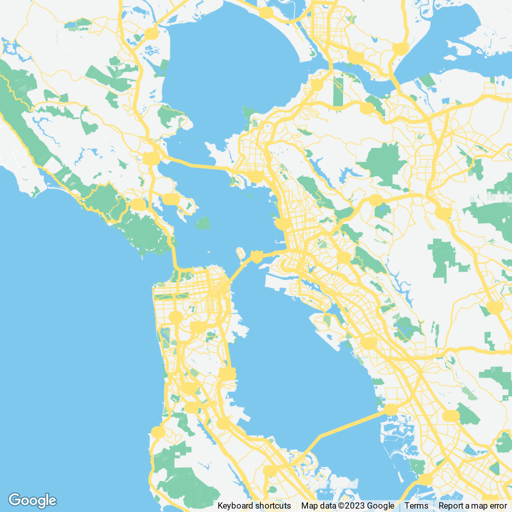

*For the purpose of this report, The Bay Area has been defined as San Francisco and the 8 surrounding counties, namely Alameda, Contra Costa, Marin, Napa, San Mateo, Santa Clara, Solano, and Sonoma Counties.*

### Increasing post-pandemic work-from-home trends





The COVID-19 pandemic dramatically increased the acceptance of remote work and flexible work hours in the Bay Area. According to a report by [WFH Research,](https://wfhresearch.com/) by July of 2023, 12.7 percent of full-time workers worked fully remote, while 28.2 percent worked on a hybrid schedule. This has led to a phenomenon referred to as the "donut effect," that describes the population shift away from city centers, creating a donut-like pattern. This trend is characterized by a decrease in population density in urban cores, particularly prominent during the COVID-19 pandemic, as remote work and changing living preferences lead individuals to relocate from city centers to surrounding suburbs or more spacious areas. 
 
There are concerns that a city heavily dependent on tax revenues from businesses and workers in city centers may face economic difficulties due to a potential decrease in these revenues with the rise of remote work. Although the primary focus of these concerns has been on the outlook for office markets, the impact of remote work could also extend to affect upcoming development initiatives and bring about shifts in retail patterns.

```{r setup, include=FALSE}
  knitr::opts_chunk$set(
    echo = TRUE,
    warning = FALSE,
    message = FALSE,
    out.width = '100%',
    fig.retina =3
  )
```

```{r packages, include=FALSE}
library(tidyverse)
library(tidycensus)
library(sf)
library(tidyr)
library(ggplot2)
library(viridis)
library(stringr)
library(mapview)
library(tigris)
library(ggplot2)
library(dplyr)
library(ggbeeswarm)
library(scales)
library(ggiraph)
library(plotly)
```

```{r acs list, include=FALSE}
acs_variable_list.2020 <- load_variables(2020, #year
                                         "acs5", #five year ACS estimates
                                         cache = TRUE)

acs_variable_list.2016 <- load_variables(2016, #year
                                         "acs5", #five year ACS estimates
                                         cache = TRUE)
```

```{r theme, include=FALSE}

theme_sk <- function(base_size = 12, title_size = 16) {
  font <- "sans"
  
  # Create a base theme
  base_theme <- theme_minimal() +
    theme(
      panel.grid.minor = element_blank(),
      axis.ticks = element_blank(),
      axis.title = element_text(family = font, size = 12),
      plot.title = element_text(family = font, size = title_size, color = "black"),
     #panel.border = element_rect(colour = "grey80", fill = NA, size = 1),
     #plot.background = element_blank(),
      text = element_text(family = font, color = "black"),
      strip.text = element_text(family = font, size = 12),
      strip.background = element_rect(fill = "grey80", color = "white"),
      axis.text = element_text(family = font, size = 10),
      plot.caption = element_text(family = font, hjust = 1),
      panel.grid.major = element_line(colour = "grey80", linetype = "longdash", size = 0.1),
      plot.subtitle = element_text(family = font, color = "grey50"),
      panel.background = element_blank()
    )
  
}
```

```{r wfh data, include=FALSE}
bay = c("San Francisco", "Alameda", "Contra Costa", "Marin", "Napa", "San Mateo", "Santa Clara", "Solano", "Sonoma")

years <- 2009:2021
names(years) <- years

wfh_value <- map_dfr(years, ~{
  get_acs(
    geography = "county",
    variables = "B99087_005",
    state = "CA",
    county = bay,
    year = .x,
    survey = "acs5"
  )
}, .id = "year")%>%
  group_by(year)%>%
  summarise(estimate = sum(estimate)) #, moe = max(moe))
```

```{r graph of WFH, fig.height=4, fig.width=8}
library(extrafont)
library(gridtext)
library(grid)

grob_explanation <- grobTree(richtext_grob(
  "<span style='background-color:white'>There has been am obvious spike in the<br>number residents working from home<br>within the Bay Area after 2019.</span>", 
  x=.3,  y=0.3, hjust=0, gp=gpar(col = "grey30", fontsize=11), box_gp = gpar(col = "white", fill = "white"),
  padding = margin(0,0,0,0,"in")))

ggplot(wfh_value, aes(x = year, y = estimate, group = 1)) + 
#  geom_ribbon(aes(ymax = estimate + moe, ymin = estimate - moe), 
 #             fill = "navy",
  #            alpha = 0.4) + 
  geom_line(color ="#21918c") + 
  geom_point(color = "#21918c", size = 2) + 
  theme_minimal(base_size = 12) + 
    geom_vline(xintercept = "2019", linetype = "longdash", size = 0.3, color = "grey50") +
   scale_y_continuous(label = scales::comma)+
#  scale_y_continuous(labels = label_dollar(scale = .001, suffix = "k")) + 
   annotation_custom(grob_explanation)+
  labs(title = "WFH residents in the Bay Area (all 9 counties)",
       x = "Year",
       y = "ACS estimate",
       caption = "Data: US Census Bureau, ACS 5-year estimates") + theme_minimal()
```

### Changes in Population Densities 

The City of San Francisco observed decline in population density within the city since the beginning of the COVID-19 pandemic, as illustrated in the following maps. Recent research indicates a migration away from San Francisco due to changing living patterns, particularly the surge in remote work. In 2018, some of the most densely populated census tracts were withing San Francisco. 

```{r data for int map1, include=FALSE, results='hide'}

bay_area_2018 <- get_acs(
  geography = "tract",
  variables = "B01001_001", #population
  year = 2018,
  state = "CA",
  county = bay ,
  geometry = TRUE
)%>%
  rename(TotalPop = estimate)

```

```{r echo=FALSE}

# Assuming 'bay_area_2018' is your data frame and 'TotalPop' is the column for which you want quartile breaks
quartile_breaks <- quantile(bay_area_2018$TotalPop, probs = c(0, 0.25, 0.5, 0.75, 1))

# Using mapview with quartile breaks
mapview(bay_area_2018, zcol = "TotalPop", at = quartile_breaks)

#intervals <- c(0, 3750, 7500, 11250, 15000)

# Using mapview with equal intervals
#mapview(bay_area_2018, zcol = "TotalPop", at = intervals)

```


```{r intmap1, eval=FALSE, include=FALSE}
cols = c('#ca0020','#f4a582','#92c5de','#0571b0')

mapview(bay_area_2018, zcol = "TotalPop")
```

However, we can see in 2021 the distribution changed significantly, with the suburbs displaying an increase in population, while the core city witnessed a decline. In 2021, the city experienced a notable 6.3 percent decrease in population, the highest in the past decade.This analysis illustrates the donut effect in the Bay Area, with the City of San Francisco as the urban core.  

```{r data for int map2, include=FALSE, results='hide'}

bay_area_2021 <- get_acs(
  geography = "tract",
  variables = "B01001_001", #population
  year = 2021,
  state = "CA",
  county = bay ,
  geometry = TRUE
)%>%
  rename(TotalPop = estimate)

```

```{r intmap2, eval=FALSE, include=FALSE}
intervals <- c(0, 3750, 7500, 11250, 15000)

mapview(bay_area_2021, zcol = "TotalPop")
```

```{r}
# Assuming 'bay_area_2018' is your data frame and 'TotalPop' is the column for which you want quartile breaks
quartile_breaks <- quantile(bay_area_2021$TotalPop, probs = c(0, 0.25, 0.5, 0.75, 1))

# Using mapview with quartile breaks
mapview(bay_area_2021, zcol = "TotalPop", at = quartile_breaks)
```


### Comparing Property Values

Rents in high-density areas and central business districts have also dropped since the pandemic's onset, reflecting a shift in housing demand from crowded urban centers to more spacious suburbs. Remote work has contributed to a substantial decrease in commercial office occupancy rates and subsequent declines in commercial property prices in densely populated Bay Area tracts. The decline in property values is driven by wealthier residents leaving high-value properties, potentially leading to reduced property taxes and straining the city's budget. Property values, as indicated by rent, are significantly higher in the suburbs of San Mateo and Santa Clara.

```{r chartnmap data, include=FALSE, results='hide'}

library(patchwork)

vt_income <- get_acs(
  geography = "county",
  variables = "B25058_001E",
  state = "CA",
  county = bay,
  year = 2020,
  geometry = TRUE
) %>%
  mutate(NAME = str_remove(NAME, " County, California"))


# Choropleth map
vt_map <- ggplot(vt_income, aes(fill = estimate)) + 
  geom_sf_interactive(aes(data_id = GEOID)) + 
  scale_fill_viridis_c() +  # Use viridis palette
  theme_void()+
  guides(fill = "none") 

# Scatter plot with error bars
vt_plot <- 
  ggplot(vt_income, aes(x = estimate, y = reorder(NAME, estimate), 
                                 fill = estimate)) +
  geom_errorbar(aes(xmin = estimate - moe, xmax = estimate + moe)) +
  geom_point_interactive(color = "black", size = 4, shape = 21,
                         aes(data_id = GEOID)) +
  scale_fill_viridis_c() +  # Use viridis palette
  scale_x_continuous(labels = scales::dollar_format()) + 
  labs(title = "Median Rent by county in the Bay Area",
       subtitle = "2020 American Community Survey",
       y = "",
       x = "Median Rent (bars represent margin of error)",
       fill = "Median Rent") + 
  theme_minimal(base_size = 14)

```

```{r chartnmap, echo=FALSE}

# Combine the maps

girafe(ggobj = vt_map + vt_plot, width_svg = 12, height_svg = 5) %>%
  girafe_options(opts_hover(css = "fill:cyan;"))
```

### Takeaways for City Planners

The analysis provides compelling evidence of the donut effect taking shape in the Bay Area. The widespread adoption of remote work is revolutionizing the traditional dynamics of daily commuting to city centers, like San Francisco.

As companies increasingly embrace remote work, employees experience reduced necessity for daily commutes, potentially reshaping the established patterns of rush hour transit activity associated with bustling city centers. This shift has implications for specific transit lines, such as the T Third Street line connecting southeastern neighborhoods like Bayview-Hunters Point and Visitacion Valley to the city's downtown area. Encouraging mixed-use developments integrating affordable housing with efficient public transportation options can mitigate the donut effect's impact and promote sustainable urban living.

The trend towards remote work and changing residential preferences may lead to a potential loss in tax revenue as individuals relocate from urban areas, impacting the traditional tax base derived from city residents. This poses a challenge for city finances, as decreased population density within city limits could reduce property taxes and other critical local revenues. In anticipation of this shortfall, planners should proactively strategize and adopt a forward-thinking approach to budgeting.

The adoption of remote work policies by tech companies is poised to significantly alter office space utilization. Businesses may reduce office footprints in response to a remote workforce, resulting in potential office vacancies. Encouraging mixed-use development projects within downtown areas can rejuvenate city centers by creating vibrant, 24/7 communities appealing to both residents and businesses.

The consequence of these changes can influence broader aspects of urban development. There is a need for city planners to adapt and strategize ensuring a harmonious transition in the Bay Area's urban landscape. 

